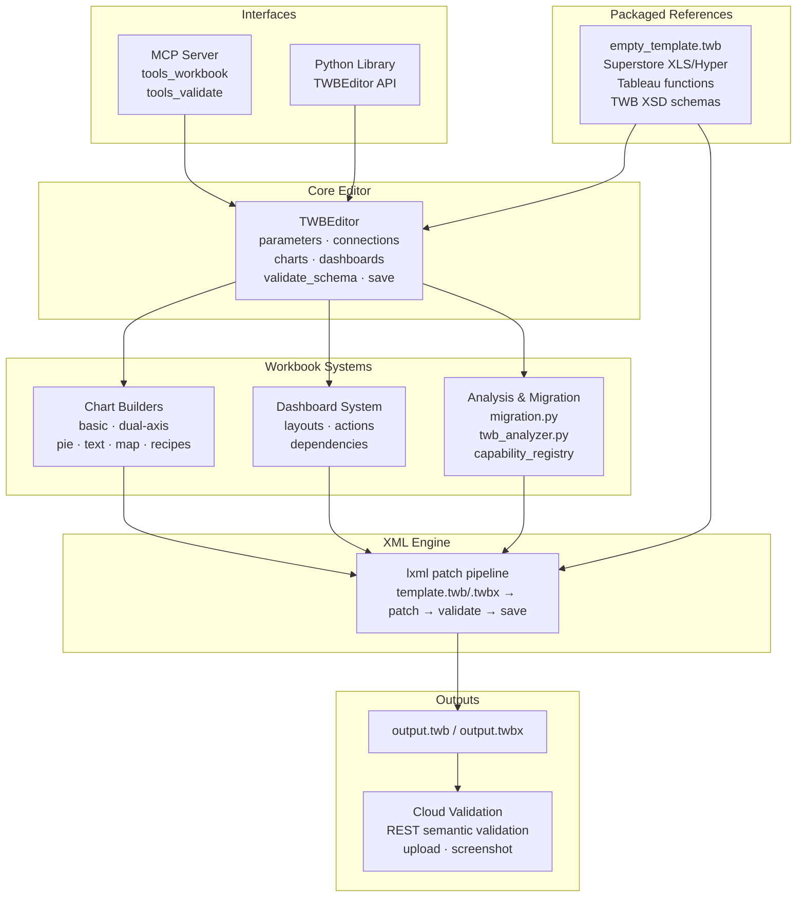

# cwtwb

<p align="center">
  
</p>

> Tableau workbook engineering for reproducible `.twb` / `.twbx` generation, validation, and migration.

<p align="center">
  
</p>

**cwtwb** is a Python toolkit and Model Context Protocol (MCP) server for building Tableau Desktop workbooks from code or agent tool calls.

It is meant to be a **workbook engineering layer**, not a conversational analytics agent. The focus is reproducibility, inspectability, and safe automation in local workflows, scripts, and CI.

The `cw` in `cwtwb` comes from `Cooper Wenhua`.


**Author:** Cooper Wenhua &lt;imgwho@gmail.com&gt;

[Website](https://datacooper.com) · [Source](https://github.com/imgwho/cwtwb) · [Changelog](https://github.com/imgwho/cwtwb/blob/main/CHANGELOG.md)

[](https://pepy.tech/projects/cwtwb)
[](https://datacooper.com)
[](https://github.com/imgwho/cwtwb)
[](https://github.com/imgwho/cwtwb/blob/main/LICENSE)
[](https://www.python.org/)


[](https://star-history.com/#imgwho/cwtwb&Date)

[Try the example workflow](examples/scripts/demo_all_supported_charts.py) · [Read the guide](https://github.com/imgwho/cwtwb/blob/main/docs/guide.md)

## Quick Start

### Install

```bash
pip install cwtwb
```

If you want the bundled Hyper-backed example too:

```bash
pip install "cwtwb[examples]"
```

If you want cloud validation (upload to Tableau Cloud/Server):

```bash
pip install "cwtwb[validate]"
```

### Run As An MCP Server

```bash
uvx cwtwb
```

The short form above remains the simplest option and is the default config shown in this repository.

Add the server to your MCP client with the same command. For example:

```json
{
  "mcpServers": {
    "cwtwb": {
      "command": "uvx",
      "args": ["cwtwb"]
    }
  }
}
```

For Claude Code:

```bash
claude mcp add cwtwb -- uvx cwtwb
```

For VSCode, add `cwtwb` to your workspace or user `mcp.json` and use `uvx cwtwb` as the command.

If you prefer an explicit script name, these equivalent launch styles also work:

```bash
uvx --from cwtwb cwtwb-mcp
python -m cwtwb.mcp_server
```

For client-specific details and the full reference, see [https://github.com/imgwho/cwtwb/blob/main/docs/guide.md](https://github.com/imgwho/cwtwb/blob/main/docs/guide.md).

## Highlights

| Area | What you get |
|---|---|
| Workbook authoring | Generate `.twb` / `.twbx` files from templates or from scratch |
| Chart building | Build bar, line, pie, map, KPI, and dual-axis workbooks |
| Safety | Validate structure, Tableau XSD (2026.1/2026.2), and REST API semantic validation before publishing |
| Cloud validation | REST API syntactic/semantic validation + upload to Tableau Cloud/Server with optional screenshot |
| Migration | Repoint existing workbooks to new data sources with explicit steps |
| MCP support | Drive workbook workflows from Claude, Cursor, VSCode, or other MCP clients |

## See It In Action

This GIF shows the MCP tool flow that builds a dashboard step by step.

<p align="center">
  
</p>

## Architecture

```
                            Interfaces
  ┌───────────────────────────────────────────────────────────────┐
  │  ┌──────────────────────────┐  ┌───────────────────────────┐  │
  │  │        MCP Server        │  │      Python Library       │  │
  │  │  tools_workbook          │  │  from cwtwb.twb_editor    │  │
  │  │  tools_validate          │  │  import TWBEditor         │  │
  │  │                          │  │                           │  │
  │  │                          │  │  editor.add_...()         │  │
  │  │                          │  │  editor.configure_...()   │  │
  │  │                          │  │  editor.validate_schema() │  │
  │  │  (Claude / Cursor /      │  │  editor.save(...)         │  │
  │  │   VSCode / Claude Code)  │  │                           │  │
  │  └─────────────┬────────────┘  └──────────────┬────────────┘  │
  │                └──────────────┬────────────────┘               │
  └─────────────────────────────  ┼  ─────────────────────────────┘
                                  ▼
  ┌───────────────────────────────────────────────────────────────┐
  │                          TWBEditor                            │
  │       ParametersMixin  ·  ConnectionsMixin                    │
  │       ChartsMixin      ·  DashboardsMixin                     │
  │       validate_schema()  ·  save()                            │
  └──────────┬──────────────────┬──────────────────┬─────────────┘
             ▼                  ▼                  ▼
  ┌──────────────────┐  ┌──────────────┐  ┌──────────────────────┐
  │  Chart Builders  │  │  Dashboard   │  │  Analysis &          │
  │                  │  │  System      │  │  Migration           │
  │  Basic  DualAxis │  │              │  │                      │
  │  Pie    Text     │  │  layouts     │  │  migration.py        │
  │  Map    Recipes  │  │  actions     │  │  twb_analyzer.py     │
  │                  │  │  dependencies│  │  capability_registry │
  └────────┬─────────┘  └──────┬───────┘  └──────────┬───────────┘
           └───────────────────┼──────────────────────┘
                               ▼
  ┌───────────────────────────────────────────────────────────────┐
  │                    Packaged References                        │
  │    empty_template.twb  ·  Superstore XLS/Hyper                │
  │    tableau_all_functions.json  ·  dataset profiles            │
  │    vendored Tableau TWB XSD schemas (2026.1 / 2026.2)         │
  └───────────────────────────────┬───────────────────────────────┘
                                  ▼
  ┌───────────────────────────────────────────────────────────────┐
  │                     XML Engine  (lxml)                        │
  │    template.twb/.twbx  →  patch  →  validate  →  save        │
  └───────────────────────────────┬───────────────────────────────┘
                                  ▼
                      output.twb  /  output.twbx
                                  ▼
  ┌───────────────────────────────────────────────────────────────┐
  │               Cloud Validation (optional)                    │
  │    validate_workbook_api → REST API semantic validation      │
  │    upload_workbook       → Tableau Cloud/Server publish      │
  │    screenshot_workbook   → capture view for visual check     │
  └───────────────────────────────────────────────────────────────┘
```

Mermaid view:



The reference layer is packaged with the library so agents and scripts can
start from known-good workbook assets, resolve Tableau calculation syntax, run
Hyper-backed examples, and validate against local XSD schemas without relying
on a checked-out repository.

## Agent Architecture

cwtwb is designed for tool-using agents, not just direct Python calls. The MCP
server gives agents a small, stateful workbook editing surface; skill resources
give phase-specific Tableau guidance before each set of tool calls.

```text
Human or agent prompt
        |
        v
MCP server instructions
        |
        v
Skill resources
calculation_builder -> chart_builder -> dashboard_designer -> formatting -> validation
        |
        v
Workbook tools
create/open -> list_fields -> add/configure -> layout -> save -> validate/upload
        |
        v
TWB/TWBX artifact + validation evidence
```

Prompts explain what to build. Skills explain how to build it well. Tools make
the workbook changes inspectable and repeatable.

## Capability Boundary

cwtwb keeps its public surface intentionally small:

| Level | Meaning |
|---|---|
| Core | Stable primitives for normal SDK docs, examples, and MCP workflows |
| Advanced | Supported compositions and interaction patterns with more moving parts |
| Recipe | Showcase patterns exposed through `configure_chart_recipe`, not one tool per chart |

Use `list_capabilities` or `describe_capability` when an agent needs to check
whether a requested chart or workbook feature belongs in the stable surface.

## Design Decisions

- The MCP server uses a stateful session model: open or create a workbook, mutate it through explicit tools, then call `save_workbook`.
- Skills are phase-specific operating guides, not generic prompt stuffing.
- `save_workbook`, `validate_workbook`, `validate_workbook_api`, and `upload_workbook` have separate responsibilities so agents do not confuse writing, local checks, semantic validation, and publishing.
- The capability registry keeps the product boundary explicit instead of letting showcase examples become accidental API promises.

## Validation

cwtwb provides four levels of workbook validation:

| Level | Description | Requires |
|---|---|---|
| **1. Local XSD** | Validate against the official Tableau TWB XSD schema (version-aware: 2026.1 or 2026.2) | None (built-in) |
| **2. REST API Syntactic** | Validate XML syntax via Tableau Cloud REST API | `.env` + Tableau Cloud 2026.2+ |
| **3. REST API Semantic** | Full semantic validation — guarantees the workbook opens in Tableau | `.env` + Tableau Cloud 2026.2+ |
| **4. Upload + Screenshot** | Publish to Tableau Cloud/Server and capture a view image | `.env` + `pip install "cwtwb[validate]"` |

```python
# Level 1 — Local XSD (in-memory, no save required)
result = editor.validate_schema()
print(result.to_text())

# Level 3 — REST API semantic validation
from cwtwb.validate.uploader import TableauUploader
uploader = TableauUploader()
result = uploader.validate("output.twb", validation_level="semantic")

# Save with local XSD validation; REST API semantic validation also runs when .env is configured
editor.save("output.twb")
```

```bash
# MCP tools
validate_workbook(file_path="output.twb")                                       # Local XSD validation
validate_workbook_api(twb_path="output.twb", validation_level="semantic")        # REST API validation
upload_workbook(twb_path="output.twb")                                          # Cloud upload
screenshot_workbook(workbook_id="...", view_name="Sheet 1")                     # Visual check
```

## FAQ

### What is the difference between `.twb` and `.twbx`?

`.twb` is the workbook XML. `.twbx` is the packaged version that bundles the workbook together with extracts and images.

### Does `validate_workbook` save files?

No. `validate_workbook()` performs local XSD validation on the active in-memory workbook or an existing `.twb` / `.twbx` file. It does not write output. `save_workbook()` is the tool that writes files.

### What validation does `save()` perform?

`save()` runs local XSD validation automatically before replacing the final output file. For `.twb` output, REST API semantic validation also runs when `.env` Tableau credentials are configured and the server supports it. Use `validate_workbook_api(..., validation_level="semantic")` when you want to request the Tableau Cloud/Server validation step directly.

### What is `upload_workbook` for?

`upload_workbook` uploads a `.twb` to Tableau Cloud/Server to verify it is structurally valid. Upload success means Tableau Cloud/Server can parse the workbook. Requires `pip install "cwtwb[validate]"` and a `.env` file with Tableau credentials (see `.env.example`).

### How do I set up Tableau Cloud/Server validation?

1. Install: `pip install "cwtwb[validate]"`
2. Copy `.env.example` to `.env`
3. Fill in your Tableau Cloud/Server PAT credentials
4. Call `save_workbook` to write the `.twb` or `.twbx`
5. Call `validate_workbook_api` for REST API semantic validation, or `upload_workbook` when you also want publish/openability evidence

### When should I use `uvx cwtwb` versus `python -m cwtwb.mcp_server`?

Use `uvx cwtwb` for the normal MCP workflow. Use `python -m cwtwb.mcp_server` for local testing without `uvx`.

For backward compatibility, `uvx --from cwtwb cwtwb-mcp`, `python -m cwtwb.server`, and `python -m cwtwb.mcp` continue to work.

### Where is the full guide?

See [the online guide](https://github.com/imgwho/cwtwb/blob/main/docs/guide.md).

## Documentation

- [Guide](https://github.com/imgwho/cwtwb/blob/main/docs/guide.md)
- [Changelog](https://github.com/imgwho/cwtwb/blob/main/CHANGELOG.md)
